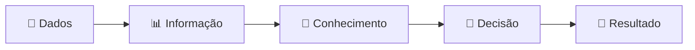
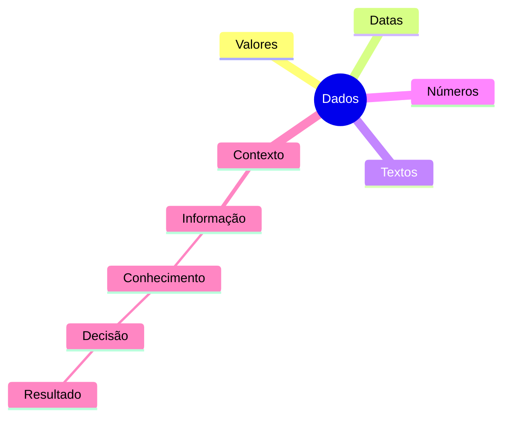

# 🗄️ Banco de Dados Relacionais
## 📖 Guia Completo para Iniciantes

<div align="center">

# 🚀 Módulo 01
# Introdução aos Bancos de Dados e aos SGBDs

### Do zero absoluto até os primeiros conceitos fundamentais

---


---

*"Antes de aprender a escrever consultas SQL, é preciso entender por que os Bancos de Dados existem."*

</div>

---

# 📚 Bem-vindo(a)!

Antes de começarmos a criar tabelas, escrever comandos SQL ou desenvolver sistemas completos, precisamos compreender **por que os Bancos de Dados existem**.

Pode parecer estranho começar por esse assunto.

Afinal, muitas pessoas pensam:

> "Eu quero aprender SQL. Por que preciso estudar toda essa teoria?"

A resposta é simples.

Imagine aprender a dirigir um carro sem saber para que serve cada pedal.

Ou aprender a pilotar um avião apenas decorando os botões do painel.

Provavelmente você até conseguiria repetir alguns procedimentos...

Mas nunca entenderia realmente o funcionamento do veículo.

Com Banco de Dados acontece exatamente a mesma coisa.

Aprender apenas comandos SQL é relativamente fácil.

O verdadeiro desafio é compreender **como as informações são organizadas, armazenadas e utilizadas dentro de um sistema**.

É exatamente isso que construiremos ao longo deste módulo.

---

# 🎯 Objetivos deste módulo

Ao concluir este primeiro módulo, você será capaz de responder perguntas como:

- ✅ O que é um dado?
- ✅ O que é uma informação?
- ✅ Qual a diferença entre ambos?
- ✅ Por que planilhas deixam de funcionar em empresas grandes?
- ✅ O que significa persistência de dados?
- ✅ O que é um Banco de Dados?
- ✅ O que é um SGBD?
- ✅ Qual a diferença entre Banco de Dados e MySQL?
- ✅ Como um sistema salva informações?
- ✅ O que acontece quando clicamos em "Cadastrar" em um sistema?

Mais importante do que decorar conceitos, você compreenderá **como tudo funciona**.

---

# 🧠 Como estudar este material

Este material foi desenvolvido pensando em pessoas que nunca estudaram Banco de Dados.

Por isso, você encontrará vários recursos que facilitarão o aprendizado.

| Símbolo | Significado |
|---------|-------------|
| 📖 | Explicação do conteúdo |
| 💡 | Curiosidade |
| 🧠 | Analogia com o cotidiano |
| 🚀 | Exemplo prático |
| ⚠️ | Atenção para um erro comum |
| 📌 | Resumo |
| 📝 | Exercícios |
| 🎯 | Desafio |

Sempre que encontrar um desses ícones, saiba que existe uma informação importante para o seu aprendizado.

---

# 🌎 Onde os Bancos de Dados estão presentes?

Talvez você nunca tenha percebido...

Mas praticamente **tudo o que fazemos na internet depende de um Banco de Dados**.

Veja alguns exemplos.

| Aplicação | O que é armazenado? |
|-----------|---------------------|
| 📸 Instagram | Usuários, fotos, comentários, curtidas |
| 🎵 Spotify | Músicas, playlists, artistas, histórico |
| 🎬 Netflix | Filmes, séries, perfis e histórico |
| 🛒 Mercado Livre | Produtos, vendedores e pedidos |
| 🚗 Uber | Motoristas, passageiros e viagens |
| 🍔 iFood | Restaurantes, pedidos e entregas |
| 💳 Nubank | Contas, PIX, cartões e transações |
| 📱 WhatsApp | Conversas, contatos e grupos |

Perceba que todos esses sistemas possuem algo em comum.

Eles precisam **guardar informações**.

E guardar informações de maneira organizada é justamente a função de um Banco de Dados.

---

# 🤔 Vamos fazer um pequeno desafio?

Antes de continuar, pense na seguinte situação.

Imagine que você criou uma pequena loja de camisetas.

No primeiro dia de funcionamento você possui apenas **cinco clientes**.

Você decide anotar tudo em um caderno.

```
Cliente 01
Lucas
Santa Maria
Comprou uma camiseta

----------------------

Cliente 02
João
Porto Alegre
Comprou duas camisetas

----------------------

Cliente 03
Maria
Pelotas
Comprou um boné
```

Até aqui...

Tudo funciona muito bem.

Agora imagine que sua loja cresce.

Depois de alguns meses você possui:

- 👥 15.000 clientes;
- 👕 8.000 produtos;
- 📦 250 pedidos por dia;
- 💳 centenas de pagamentos diariamente.

Agora responda.

## ❓Como você encontraria rapidamente:

- Todos os pedidos realizados por um cliente?
- Todos os produtos vendidos hoje?
- Qual foi o produto mais vendido do mês?
- Quantos clientes compraram acima de R$ 500?

Começa a ficar difícil, não é?

---

# 🧠 Analogia

Imagine uma biblioteca.

Se todos os livros fossem colocados em uma única pilha no chão, quanto tempo levaria para encontrar apenas um deles?

Provavelmente muito tempo.

Agora imagine essa mesma biblioteca organizada.

Cada livro possui:

- uma estante;
- uma prateleira;
- uma categoria;
- um código;
- uma posição específica.

Encontrar qualquer livro leva apenas alguns segundos.

Um Banco de Dados funciona exatamente da mesma maneira.

Ele organiza informações para que possam ser encontradas rapidamente.

---

# 🚀 Na prática

Sempre que você realiza alguma destas ações...

- Fazer login no Instagram;
- Assistir a um filme na Netflix;
- Enviar uma mensagem no WhatsApp;
- Comprar um produto na Shopee;
- Fazer um PIX;
- Pedir comida pelo iFood;

...há um Banco de Dados trabalhando nos bastidores.

Mesmo que você nunca veja.

---

# 💡 Curiosidade

Você provavelmente utiliza dezenas de Bancos de Dados todos os dias sem perceber.

Cada curtida no Instagram.

Cada mensagem enviada.

Cada música reproduzida.

Cada compra realizada.

Tudo isso gera novas informações que precisam ser armazenadas.

Em empresas como Google, Amazon e Meta, são gravados **milhões de novos registros por minuto**.

Isso só é possível graças aos Bancos de Dados.

---

# 📌 Resumo desta seção

Ao finalizar esta primeira leitura, você já deve compreender que:

- Um Banco de Dados existe para armazenar informações.
- Ele está presente em praticamente todos os sistemas modernos.
- Empresas dependem dele para funcionar.
- Sem Bancos de Dados, serviços como WhatsApp, Instagram, Netflix e Pix simplesmente não existiriam como conhecemos hoje.
- Antes de aprender SQL, precisamos entender o problema que os Bancos de Dados vieram resolver.

---

# ➡️ Próximo capítulo

No próximo capítulo responderemos uma das perguntas mais importantes de toda a Computação:

> **Qual é a diferença entre um dado e uma informação?**

Embora essas palavras pareçam sinônimas, elas possuem significados completamente diferentes.

Entender essa diferença será a base para todo o restante do curso.

---

# 📊 Capítulo 2 — Dado × Informação

> *"Todo sistema do mundo trabalha com dados. Mas somente quando esses dados fazem sentido é que eles se tornam informações."*

---

# 🤔 Antes de começarmos...

Vamos imaginar uma situação muito simples.

Imagine que eu escreva apenas este número na lousa:

# **23**

Agora pense por alguns segundos.

## ❓O que significa esse número?

Talvez você tenha pensado em:

- 🎂 Uma idade;
- 🌡️ Uma temperatura;
- ⚽ O número de uma camisa;
- 📦 A quantidade de produtos em estoque;
- 💰 Um preço;
- 📚 O número de uma sala;
- 📅 Um dia do mês.

E qual dessas respostas está correta?

A resposta é...

## ✅ Todas elas.

E, ao mesmo tempo...

## ❌ Nenhuma.

Parece estranho?

Não se preocupe.

Essa é exatamente a primeira grande lição sobre Banco de Dados.

O número **23**, sozinho, **não significa absolutamente nada**.

Ele apenas representa um valor.

É somente quando adicionamos contexto que esse valor passa a ter significado.

É exatamente aqui que nasce a diferença entre **Dado** e **Informação**.

---

# 📖 O que é um Dado?

## 📌 Definição

Um **dado** é um valor bruto.

Ele representa um fato, um número, um texto, uma data ou qualquer outro valor que ainda **não possui significado suficiente para ser interpretado sozinho**.

Em outras palavras...

> **Um dado é apenas uma peça de informação que ainda está "solta".**

---

## 🧠 Analogia

Imagine um quebra-cabeça de 5.000 peças.

Uma única peça possui algum significado?

Provavelmente não.

Ela possui apenas uma pequena parte da imagem.

Agora imagine todas as peças montadas.

Nesse momento você consegue enxergar toda a figura.

Os dados funcionam exatamente assim.

Cada dado é como uma peça do quebra-cabeça.

Sozinho...

Ele dificilmente explica alguma coisa.

---

## 🚀 Exemplos de Dados

Observe os valores abaixo.

| Valor |
|--------|
| Lucas |
| 23 |
| Santa Maria |
| 1500 |
| 05/06/2026 |
| true |
| SP |
| Notebook |

Todos eles são dados.

Mas...

Ainda não sabemos:

- Quem é Lucas?
- O que significa 23?
- 1500 representa dinheiro?
- Quilômetros?
- Quantidade?
- Pontos?
- A data representa nascimento?
- Compra?
- Pagamento?

Sem contexto...

Não existe interpretação.

---

# 🎨 Visualizando um dado

```text
             DADO

        ┌───────────┐
        │     23    │
        └───────────┘

Pergunta:

O que significa?

🤔 Não sabemos.
```

---

# 💡 Curiosidade

Um computador não entende o significado de um dado.

Para ele...

Tudo são apenas números e caracteres.

Quem dá significado aos dados somos nós, seres humanos.

---

# ⚠️ Erro muito comum

Muitas pessoas acreditam que um dado já possui significado.

Na realidade...

Um dado apenas representa alguma coisa.

Quem fornece o significado é o contexto onde ele está inserido.

---

# 📖 O que é uma Informação?

Agora vamos utilizar exatamente o mesmo número.

```
23
```

Mas desta vez escreveremos:

```
Lucas possui 23 anos.
```

Percebe a diferença?

Agora você já consegue responder perguntas como:

- Qual é a idade do Lucas?
- Ele é maior de idade?
- Está apto para tirar carteira de motorista?
- Pode fazer uma faculdade?

O número continua sendo **23**.

O que mudou foi o contexto.

---

## 📌 Definição

Uma **informação** é um dado que recebeu significado.

Ou seja...

É um dado interpretado dentro de um contexto.

Podemos resumir assim:

> **Informação = Dado + Contexto**

---

# 🎨 Visualizando

```text
ANTES

23

↓

Não sabemos o significado.

----------------------------

DEPOIS

Lucas possui 23 anos.

↓

Agora existe contexto.

↓

Agora existe significado.

↓

Agora existe uma informação.
```

---

# 🧠 Analogia

Imagine que você encontra um papel escrito:

```
15
```

Isso é apenas um dado.

Agora imagine que alguém diz:

```
Hoje fazem 15°C.
```

Agora você já sabe que:

- Está frio;
- Talvez precise de um casaco;
- Não será um dia muito quente.

O número continua sendo o mesmo.

Mas a utilidade mudou completamente.

---

# 🚀 Exemplos

| Dado | Informação |
|------|------------|
| Lucas | O cliente chama-se Lucas. |
| 150 | O produto custa R$ 150,00. |
| SP | O pedido será entregue em São Paulo. |
| 18 | O aluno possui 18 anos. |
| 05/06/2026 | A compra foi realizada em 05/06/2026. |

Observe que o dado é exatamente o mesmo.

Quem transforma esse dado em informação é o contexto.

---

# 🏢 Exemplo do mundo real

Imagine um supermercado.

O sistema possui o seguinte valor.

```
4
```

Esse número pode significar:

- quatro produtos vendidos;
- quatro funcionários;
- quatro caixas abertos;
- quatro clientes aguardando;
- quatro unidades em estoque.

Agora veja este exemplo.

```
O produto Coca-Cola possui 4 unidades em estoque.
```

Agora sabemos exatamente o significado.

Essa é uma informação.

---

# 🌎 Onde isso aparece?

Praticamente em qualquer sistema.

### 📸 Instagram

Dado

```
1500
```

Informação

```
A publicação recebeu 1.500 curtidas.
```

---

### 🎬 Netflix

Dado

```
58
```

Informação

```
O usuário assistiu 58 minutos do filme.
```

---

### 🎵 Spotify

Dado

```
320
```

Informação

```
Você ouviu 320 músicas neste mês.
```

---

### 💳 Banco

Dado

```
850
```

Informação

```
Seu saldo disponível é de R$ 850,00.
```

---

# 📊 Comparando

| Dado | Informação |
|------|------------|
| Valor bruto | Valor interpretado |
| Não possui contexto | Possui contexto |
| Não auxilia decisões | Auxilia decisões |
| Isolado | Organizado |
| Pouco significado | Muito significado |

---

# 🧠 Imagine uma biblioteca

Imagine uma biblioteca com milhares de livros.

Agora imagine que alguém lhe entrega apenas este papel.

```
A27
```

O que significa?

Provavelmente nada.

Agora imagine que a bibliotecária diz:

```
O livro de Banco de Dados está na estante A,
prateleira 2,
posição 7.
```

Agora "A27" passou a fazer sentido.

Novamente...

O dado é o mesmo.

O contexto criou a informação.

---

# 💡 Você sabia?

Todos os dias o Google processa bilhões de dados.

Mas esses dados só se tornam úteis porque são organizados e interpretados.

Caso contrário...

Seriam apenas bilhões de números sem significado.

---

# 📌 Resumo deste capítulo

Ao finalizar esta leitura você deve lembrar de apenas uma frase:

> **Informação = Dado + Contexto**

Sempre que um dado recebe significado, ele deixa de ser apenas um valor bruto e passa a ser uma informação útil para pessoas e empresas.

Essa é a base de praticamente todos os sistemas computacionais existentes atualmente.

---

# 🧠 Capítulo 3 — Como um dado se transforma em conhecimento

> *"Empresas não tomam decisões baseadas em 'achismos'. Elas tomam decisões baseadas em informações."*

---

# 🤔 Uma pergunta antes de começarmos...

Imagine que você acabou de abrir uma pequena loja de roupas.

Durante um único dia de funcionamento aconteceram as seguintes vendas:

```
👕 Camiseta Preta

👖 Calça Jeans

👕 Camiseta Preta

👕 Camiseta Preta

🧢 Boné

👕 Camiseta Preta

👟 Tênis

👕 Camiseta Preta
```

Agora pare por alguns segundos e responda.

## ❓O que você consegue concluir apenas olhando essa lista?

Provavelmente você respondeu:

> "A Camiseta Preta foi o produto mais vendido."

Parabéns! 🎉

Você acabou de transformar vários **dados** em uma **informação**.

Mas... e se eu fizer outra pergunta?

---

## 🤔 Por que a Camiseta Preta vendeu tanto?

Agora ficou mais difícil.

Apenas olhar para os dados não é suficiente.

Precisamos analisá-los.

Talvez:

- Era o produto mais barato;
- Estava em promoção;
- Era o único disponível;
- Era inverno;
- Os clientes gostaram mais daquela cor.

Percebe o que aconteceu?

Agora você não está apenas observando informações.

Você começou a produzir **conhecimento**.

E esse conhecimento permite tomar decisões.

---

# 🎯 A Cadeia de Valor dos Dados

Toda empresa moderna trabalha seguindo praticamente este fluxo.



Parece simples.

Mas essa pequena sequência movimenta bilhões de reais todos os dias.

Vamos entender cada etapa.

---

# 📄 Etapa 1 — Dados

Tudo começa aqui.

Os sistemas registram absolutamente tudo.

Imagine um supermercado.

Sempre que um cliente compra um produto, o sistema registra informações como:

| Produto | Quantidade | Valor | Horário |
|----------|------------|--------|----------|
| Camiseta | 1 | R$ 59,90 | 14:05 |
| Boné | 2 | R$ 35,00 | 14:18 |
| Calça | 1 | R$ 129,90 | 14:42 |

Esses registros são apenas dados.

Ainda não existe nenhuma conclusão.

---

## 💡 Curiosidade

Uma grande rede de supermercados pode registrar milhões de novos dados todos os dias.

Sozinhos...

Esses registros possuem pouco valor.

---

# 📊 Etapa 2 — Informação

Agora imagine que o gerente pergunta:

> "Qual produto vendeu mais hoje?"

O sistema analisa todos aqueles registros.

Depois responde:

```
👕 Camiseta

Quantidade vendida:

325 unidades.
```

Pronto.

Agora temos uma informação.

Observe que ela nasceu a partir de centenas de dados.

---

## 🧠 Analogia

Imagine milhares de peças de LEGO espalhadas no chão.

Cada peça representa um dado.

Quando você monta o castelo completo...

Você criou uma informação.

---

# 🧠 Etapa 3 — Conhecimento

Agora o gerente faz outra pergunta.

> "Por que a camiseta vendeu tanto?"

O sistema cruza informações.

Talvez descubra:

- Era sexta-feira;
- Estava em promoção;
- Influenciadores divulgaram o produto;
- O estoque estava completo.

Agora não temos apenas informações.

Temos conhecimento.

Conhecimento significa compreender o motivo das coisas acontecerem.

---

# 🎯 Etapa 4 — Decisão

Com esse conhecimento...

O gerente toma uma decisão.

```
Vamos comprar mais camisetas.

Vamos aumentar o estoque.

Vamos repetir essa promoção.
```

Perceba.

A decisão não surgiu do nada.

Ela foi baseada em conhecimento.

---

# 🚀 Etapa 5 — Resultado

Depois da decisão...

A empresa vende mais.

Lucra mais.

Atende mais clientes.

Tudo começou com um simples dado.

---

# 🌎 Estudo de Caso 1 — Instagram

Vamos imaginar que você publicou uma foto.

Durante o dia aconteceram estas ações.

```
❤️ Curtidas

💬 Comentários

📤 Compartilhamentos

📌 Salvamentos
```

Cada uma dessas ações é um dado.

Agora o Instagram analisa esses dados.

Ele percebe:

> Essa publicação recebeu muito mais curtidas que as anteriores.

Agora existe uma informação.

Depois ele percebe outra coisa.

> Pessoas entre 18 e 25 anos gostaram muito dessa publicação.

Agora existe conhecimento.

Então o algoritmo decide:

```
Mostrar essa publicação para mais pessoas.
```

Essa foi a decisão.

Tudo começou com alguns cliques.

---

# 🎬 Estudo de Caso 2 — Netflix

Imagine que você começou um filme.

O sistema registra:

```
▶️ Horário

⏸️ Momento da pausa

⏩ Avanços

⏪ Retrocessos

⭐ Avaliação
```

Esses registros são apenas dados.

Depois o sistema percebe:

```
Você assiste muitos filmes de ação.
```

Agora temos uma informação.

Depois ele percebe:

```
Você sempre assiste filmes de ação nas noites de sexta-feira.
```

Agora existe conhecimento.

Então a Netflix recomenda novos filmes de ação.

Essa é a decisão.

---

# 🎵 Estudo de Caso 3 — Spotify

Durante o mês você ouviu:

- Rock
- Pop
- Rock
- Rock
- Rock
- MPB
- Rock

Esses registros são dados.

Depois o Spotify percebe:

```
Seu gênero favorito é Rock.
```

Informação.

Depois percebe:

```
Você escuta Rock principalmente durante o trabalho.
```

Conhecimento.

Então cria uma playlist personalizada.

Decisão.

---

# 🛒 Estudo de Caso 4 — Mercado Livre

Imagine que milhares de pessoas pesquisam:

```
Notebook Gamer
```

O sistema registra isso.

Depois percebe.

```
Notebook Gamer aumentou muito nas pesquisas.
```

Informação.

Depois descobre.

```
As pesquisas aumentam sempre perto da Black Friday.
```

Conhecimento.

Então faz uma decisão.

```
Mostrar notebooks na página inicial.
```

---

# 🧠 Como um Analista de Sistemas pensa?

Um usuário normalmente pensa assim.

> Quero comprar um celular.

Um Analista pensa diferente.

Ele pergunta:

- Onde essa compra será armazenada?
- Qual tabela receberá esses dados?
- Quem poderá consultar essa compra?
- Como garantir que ela nunca seja perdida?

É exatamente por isso que estudamos Banco de Dados.

---

# ⚠️ Erro muito comum

Muitas pessoas acreditam que empresas armazenam informações.

Na verdade...

Elas armazenam principalmente **dados**.

As informações são produzidas quando esses dados são processados.

Esse detalhe é muito importante.

O Banco de Dados armazena dados.

O sistema transforma esses dados em informações.

---

# 🧩 Quiz rápido

Antes de continuar, tente responder sozinho.

## 1️⃣ Qual destes exemplos representa apenas um dado?

- ( ) João possui 20 anos.
- ( ) O produto custa R$ 50.
- ( ) 20
- ( ) O cliente mora em Santa Maria.

<details>
<summary>✅ Resposta</summary>

O número **20** sozinho.

Ele ainda não possui contexto.

</details>

---

## 2️⃣ Uma informação é...

- ( ) Um número qualquer.
- ( ) Um dado sem significado.
- ( ) Um dado interpretado dentro de um contexto.
- ( ) Um arquivo.

<details>
<summary>✅ Resposta</summary>

Um dado interpretado dentro de um contexto.

</details>

---

# 📌 Mapa Mental



---

# 📚 Glossário

| Termo | Significado |
|--------|-------------|
| **Dado** | Valor bruto, sem contexto suficiente para gerar significado. |
| **Informação** | Dado interpretado dentro de um contexto. |
| **Conhecimento** | Entendimento obtido pela análise das informações. |
| **Decisão** | Ação tomada com base no conhecimento adquirido. |
| **Resultado** | Consequência gerada pela decisão tomada. |

---

# 📌 Resumo Geral

Se você lembrar apenas de uma única imagem deste capítulo...

Que seja esta.

```text
📄 DADOS
      │
      ▼
📊 INFORMAÇÃO
      │
      ▼
🧠 CONHECIMENTO
      │
      ▼
🎯 DECISÃO
      │
      ▼
🚀 RESULTADO
```

Toda empresa moderna trabalha exatamente dessa forma.

A diferença está apenas na quantidade de dados que ela processa.

---

# 🎉 Parabéns!

Você acabou de aprender um dos conceitos mais importantes de toda a Computação.

Pode parecer um assunto simples...

Mas essa pequena sequência é utilizada por bancos, hospitais, escolas, universidades, redes sociais, aplicativos de transporte, sistemas de streaming, e praticamente qualquer software existente atualmente.

Agora você já consegue responder uma pergunta que muitos iniciantes confundem:

> **"Qual é a diferença entre um dado e uma informação?"**

E mais importante...

Você já entende **por que essa diferença existe**.

---

# ➡️ Próximo capítulo

Até agora descobrimos como os dados se transformam em informações.

Mas surge uma nova dúvida.

🤔 **Onde todas essas informações ficam armazenadas?**

Será que ficam apenas na memória do computador?

Será que desaparecem quando o sistema é desligado?

É exatamente isso que descobriremos no próximo capítulo, quando entenderemos o conceito de **Persistência de Dados**.
